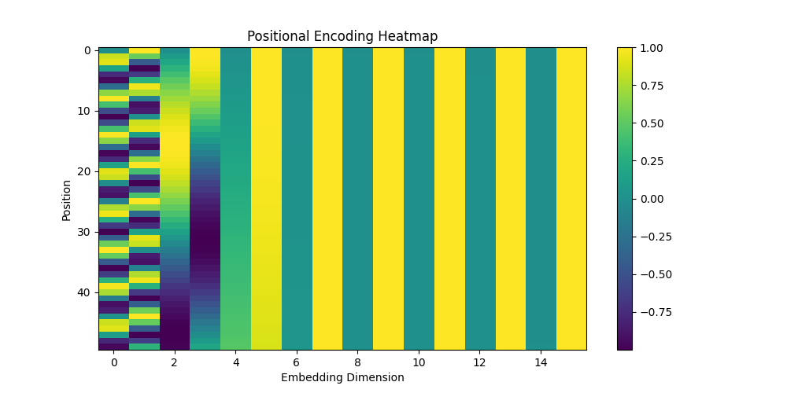

# Transformer Network

## Introduction

The Transformer is a deep learning architecture introduced in 2017 in the paper “Attention Is All You Need”. Unlike recurrent neural networks (RNNs), transformers process all input tokens in parallel. This makes them significantly faster and more scalable.

Transformers are widely used in natural language processing (NLP), but they are also applied in cybersecurity tasks such as log analysis, phishing detection, anomaly detection, and threat intelligence processing.

---

## Core Components of Transformer

A transformer consists of:

- Input Embedding
- Positional Encoding
- Multi-Head Self-Attention
- Feed-Forward Neural Network
- Layer Normalization

---

## Self-Attention Mechanism

Self-attention allows the model to focus on relevant parts of the input sequence when processing each token.

For each token, three vectors are computed:

- Query (Q)
- Key (K)
- Value (V)

The attention score is calculated as:

Attention(Q, K, V) = softmax(QKᵀ / √d) V

This mechanism allows the model to determine which tokens are important in context.

---

## Positional Encoding

Since transformers process tokens in parallel, they do not inherently understand sequence order. Positional encoding adds information about token position using sine and cosine functions:

PE(pos, 2i) = sin(pos / 10000^(2i/d))  
PE(pos, 2i+1) = cos(pos / 10000^(2i/d))

This allows the model to understand sequence structure.


---

## Self-Attention Visualization

Below is a simplified conceptual representation of the self-attention mechanism:


    Query (Q)
        |
        v
 Q × Kᵀ (Similarity Score)
        |
     Softmax
        |
    × Value (V)
        |
     Output


This diagram shows how queries interact with keys to produce attention weights, which are then applied to values.
### Positional Encoding Heatmap




---

## Positional Encoding Visualization

Below is a Python example that visualizes sinusoidal positional encoding:

```python
import numpy as np
import matplotlib.pyplot as plt

def positional_encoding(position, d_model):
    PE = np.zeros((position, d_model))
    for pos in range(position):
        for i in range(0, d_model, 2):
            PE[pos, i] = np.sin(pos / (10000 ** ((2*i)/d_model)))
            if i + 1 < d_model:
                PE[pos, i+1] = np.cos(pos / (10000 ** ((2*i)/d_model)))
    return PE

position = 50
d_model = 16

PE = positional_encoding(position, d_model)

plt.figure(figsize=(10,5))
plt.imshow(PE, aspect='auto')
plt.title("Positional Encoding Heatmap")
plt.xlabel("Embedding Dimension")
plt.ylabel("Position")
plt.colorbar()
plt.show()


---

## Transformer Application in Cybersecurity: Log Anomaly Detection

Transformers are widely used for analyzing sequential log data in cybersecurity systems.

In a real-world environment, servers generate thousands of log entries per minute. These logs contain sequences of events such as:

- User login
- File access
- Failed authentication attempts
- Privilege escalation
- Network connections

Since logs are sequential data, transformers are well suited for modeling dependencies between events.

### Example Scenario

Consider the following log sequence:

1. Successful login
2. File access
3. Multiple failed admin login attempts
4. Sudden privilege escalation

A transformer-based model can learn normal behavioral patterns and detect deviations from them.

### Why Transformer is Effective Here

- Self-attention captures relationships between distant log events.
- Parallel processing allows large-scale log analysis.
- Context-aware modeling improves anomaly detection accuracy.

In practice, such models are used in:
- SIEM systems
- Threat detection platforms
- Insider threat monitoring
- Advanced persistent threat (APT) detection

