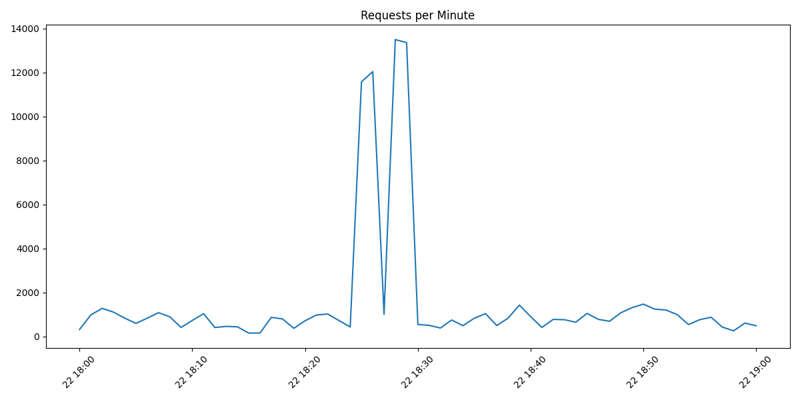
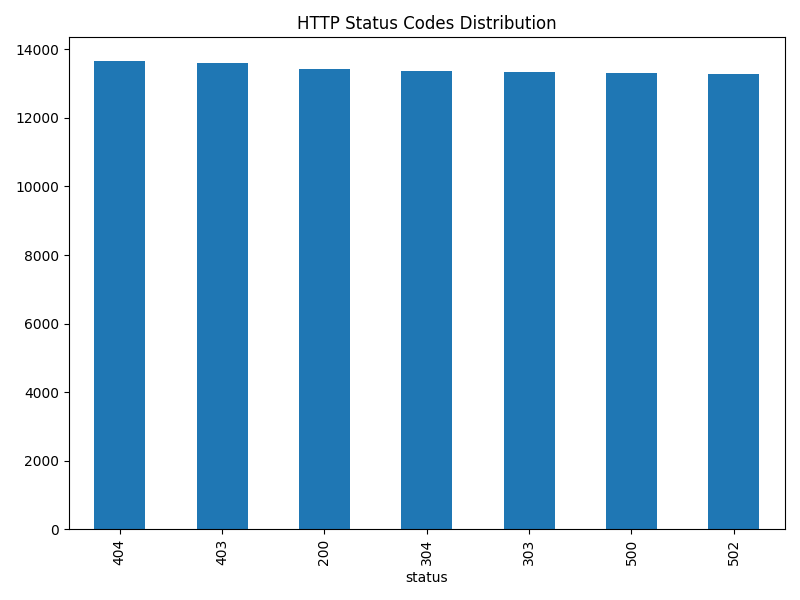
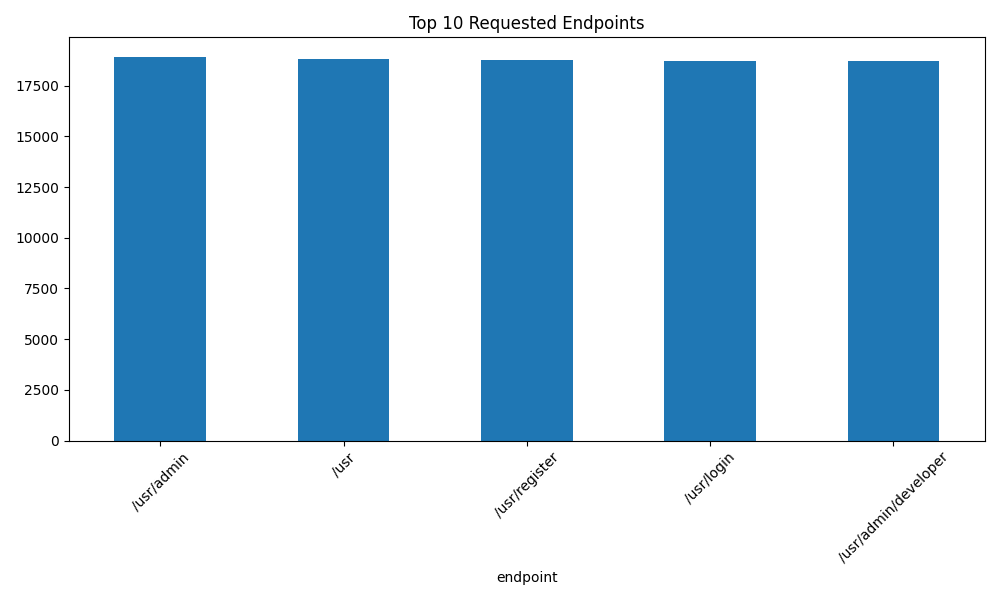
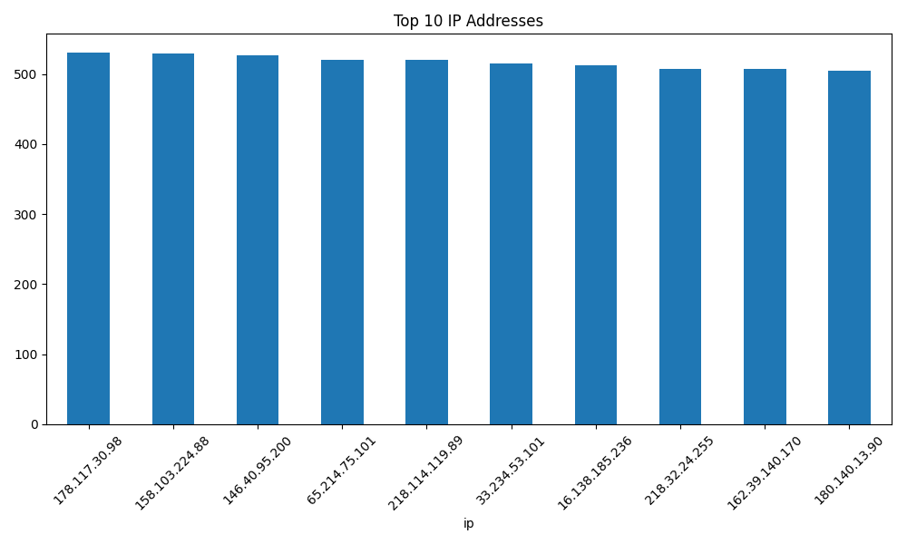

# DDoS Traffic Analysis

## Traffic Anomaly Detection

The traffic analysis reveals a significant anomaly between 18:24 and 18:29, where the number of requests per minute sharply increases from a baseline of approximately 500–1500 requests to over 12,000 requests per minute.

This abnormal surge indicates a potential Distributed Denial-of-Service (DDoS) attack.

The presence of multiple source IP addresses and repeated requests to sensitive endpoints such as /usr/admin and /usr/login further supports the likelihood of coordinated malicious activity.

## Requests per Minute

## HTTP Status Code Distribution

## Top Requested Endpoints

## Top IP Addresses

